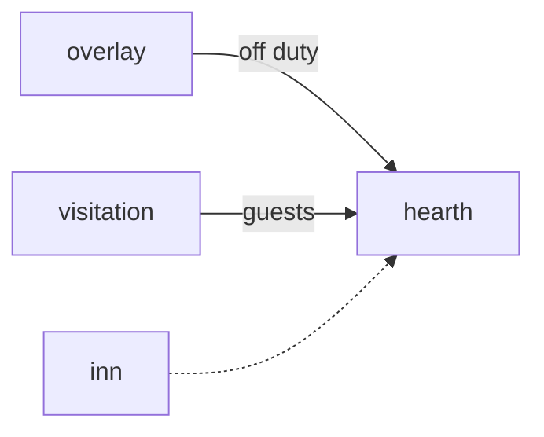

# Hearth

**Pet Village Builder** — Isometric homeland where off-duty pets build, nap, and receive visitors.

Part of [ComputerPets](https://github.com/RicheyWorks/computerpets). Map: [computerpets-ecosystem](https://github.com/RicheyWorks/computerpets-ecosystem).

| | |
| --- | --- |
| Status | Design scaffold — loop and engine frozen |
| License | MIT |
| Tokens | Minigames never mint or burn. Tired overlay, not a dead lineage. |
| First pet | [Meet Rui first](https://github.com/RicheyWorks/computerpets/blob/main/docs/START-HERE.md). This game is optional. |

## The loop

When a pet is not on the desktop, it is in Hearth. Buildings are habitats from Lore. A reef house will not accept Rui as a resident.

## Who plays

Pets not on the desktop. They live here until recalled.

## What it is not

Not a 4X. Reef house will not take Rui as a resident.

## Genre and engine

- Genre: **Isometric management**
- Engine: **Phaser.js**
- Stack: TypeScript · Phaser 3 isometric · off-duty pets as villagers · Visitation as visitors
- Default surface: `8080`

## Architecture



## How you play

1. Assign idle pets to plots.
2. Build biome-legal structures.
3. Visitors from Visitation walk through.
4. Desktop recall yanks a villager back to overlay.

## First slice

Build this and stop.

**One forest plot, Rui idle villager, recall yanks him back to overlay.**

You know it works when: Recall pauses the job. Illegal biome: ghost plot. Save local + cloud.

## Environment

Node 22

## Failure doctrine

Recall during build → job pauses, not lost. Illegal biome assign → ghost plot, no crash. Save is cloud + local.

Canon rules that never yield:

- 210 living kinds. No illegal hybrids.
- Overlay pets can get tired, sick, or hide. Tokens are not burned by a minigame.
- Desktop walk stays the main quest. Closing Hearth must leave Rui walking.

## Neighbors

- computerpets-visitation
- computerpets-lore
- computerpets-acre
- computerpets-inn
- computerpets-companion

## Layout

```
computerpets-hearth/
  README.md
  LICENSE
  docs/DESIGN.md
  src/                implementation lands here
```

## Run (Windows)

```powershell
cd app; npm install; npm run dev
```

Meet Rui first via the [flagship start-here](https://github.com/RicheyWorks/computerpets/blob/main/docs/START-HERE.md). This game is optional.

## Links

- Flagship: [RicheyWorks/computerpets](https://github.com/RicheyWorks/computerpets)
- This repo: [RicheyWorks/computerpets-hearth](https://github.com/RicheyWorks/computerpets-hearth)
- Map: [RicheyWorks/computerpets-ecosystem](https://github.com/RicheyWorks/computerpets-ecosystem)
- Design file: [docs/DESIGN.md](docs/DESIGN.md)

## License

MIT. See [LICENSE](LICENSE).

---

*Two hundred ten living kinds. Keep them so a line does not go quiet.*
