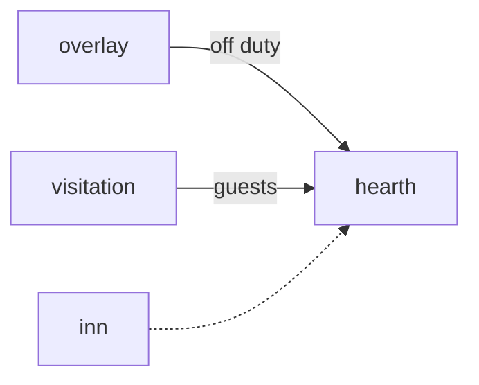

# Hearth

**Pet Village Builder** — A planned village builder where off-duty pets settle into habitats and welcome visitors.

Part of [ComputerPets](https://github.com/RicheyWorks/computerpets). Map: [computerpets-ecosystem](https://github.com/RicheyWorks/computerpets-ecosystem).

[Status](#status) · [Design](docs/DESIGN.md) · [Contributor start](#contributor-start) · [Ecosystem](https://github.com/RicheyWorks/computerpets-ecosystem)

| Project | At a glance |
| --- | --- |
| Status | Design scaffold; not runnable yet |
| License | MIT |
| Tokens | Minigames never mint or burn. Tired overlay, not a dead lineage. |
| First pet | [Flagship start guide](https://github.com/RicheyWorks/computerpets/blob/main/docs/START-HERE.md) |

## Status

This repository contains a [design](docs/DESIGN.md) and a [source placeholder](src/index.ts). It has no runnable application, build manifest, automated tests, or CI workflow.

The experience, interfaces, integrations, and safeguards below are **implementation plans**, not supported features. The first implementation slice defines the initial contribution target.

## Planned experience

When a pet is not on the desktop, it is in Hearth. Buildings are habitats from Lore. A reef house will not accept Rui as a resident.

## Intended audience

Pets not on the desktop. They live here until recalled.

## Out of scope

Not a 4X. Reef house will not take Rui as a resident.

## Planned genre and engine

- Genre: **Isometric management**
- Engine: **Phaser.js**
- Stack: TypeScript · Phaser 3 isometric · off-duty pets as villagers · Visitation as visitors
- Proposed surface: `8080`

## Proposed integration



## Proposed play loop

1. Assign idle pets to plots.
2. Build biome-legal structures.
3. Visitors from Visitation walk through.
4. Desktop recall yanks a villager back to overlay.

## First implementation slice

Initial implementation target:

**One forest plot, Rui idle villager, recall yanks him back to overlay.**

Acceptance targets: Recall pauses the job. Illegal biome: ghost plot. Save local + cloud.

## Planned environment

Node 22

## Planned safeguards

Recall during build → job pauses, not lost. Illegal biome assign → ghost plot, no crash. Save is cloud + local.

Design constraints:

- 210 living kinds. No illegal hybrids.
- Overlay pets can get tired, sick, or hide. Tokens are not burned by a minigame.
- Desktop walk stays the main quest. Closing Hearth must leave Rui walking.

## Related projects

- [computerpets-visitation](https://github.com/RicheyWorks/computerpets-visitation)
- [computerpets-lore](https://github.com/RicheyWorks/computerpets-lore)
- [computerpets-acre](https://github.com/RicheyWorks/computerpets-acre)
- [computerpets-inn](https://github.com/RicheyWorks/computerpets-inn)
- [computerpets-companion](https://github.com/RicheyWorks/computerpets-companion)

## Layout

```
computerpets-hearth/
  README.md
  LICENSE
  docs/DESIGN.md
  src/                implementation lands here
```

## Contributor start

With Git and PowerShell, clone the scaffold and read its design and source marker:

```powershell
git clone https://github.com/RicheyWorks/computerpets-hearth.git
Set-Location computerpets-hearth
Get-Content .\docs\DESIGN.md
Get-Content .\src\index.ts
```

Start with the [first implementation slice](#first-implementation-slice). Add the minimum project setup and tests needed for that slice, then document verified run commands. The proposed stack above is a design choice; there is no install or launch command for this checkout yet.

## Links

- Flagship: [RicheyWorks/computerpets](https://github.com/RicheyWorks/computerpets)
- This repo: [RicheyWorks/computerpets-hearth](https://github.com/RicheyWorks/computerpets-hearth)
- Map: [RicheyWorks/computerpets-ecosystem](https://github.com/RicheyWorks/computerpets-ecosystem)
- Design file: [docs/DESIGN.md](docs/DESIGN.md)

## License

MIT. See [LICENSE](LICENSE).

---

*Two hundred ten living kinds. Keep them so a line does not go quiet.*
